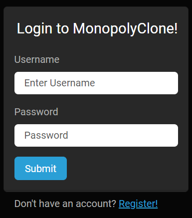
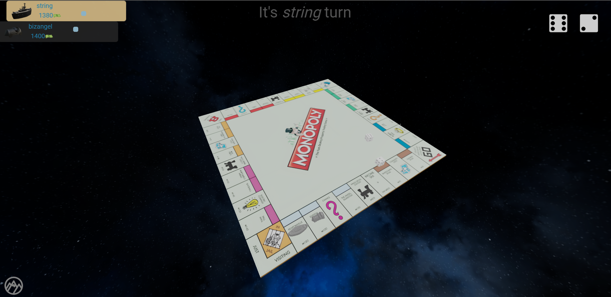
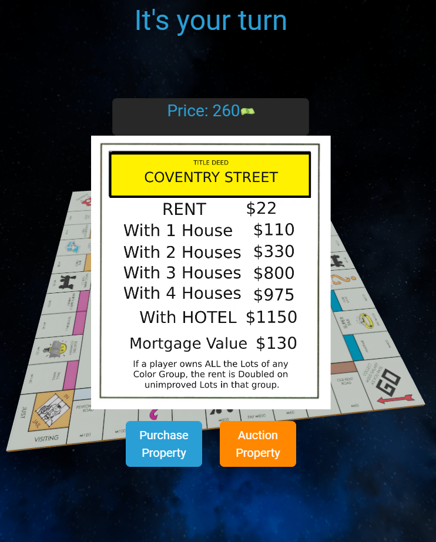
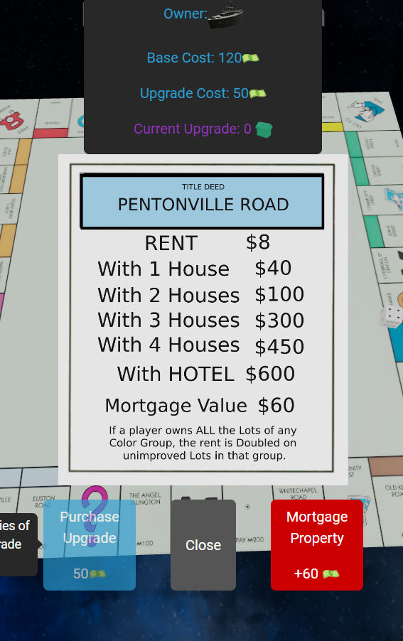

# MonopolyClone
## Context

This is yet another personal project game I made for me and my friends to play.

This is a fully playable Monopoly board game. Right off the bat with just your browser. [See below for technologies used!](#technologies-used)

## Showcase

Once up and running the game greets with you a regular login screen:

After logging in, you're then presented to input a lobby password, after inputting the password you effectively join a fancy lobby screen, to select your character, mario-kart style:

After all players have locked their choice. The game effectively starts, featuring a 3D scene, with the pieces, the gameboard, and fully pannable, dragable and zoomable camera, with the help of three.js orbit controls:

Alongside the 3D Scene, we can see some UI overlays, such as the top that display current players information.

Most of the game actions are synchronized. So the players are kept up to date to whats happening, and trying to give that connection sense as if actually playing monopoly in real life.

UI overlays pop up according to the context so that the player can take proper action when needed. Such as to when to buy a property or not:

As well as details panels displaying information about a property:

This way the game fully supports most monopoly game mechanics. Such as trading, upgrading by buying houses/hotels, mortgaging properties, going to jail, etc. As well as a game results page displaying winners when the game finalizes.

This is just a quick overview of the game as a whole and I didn't wanna fully clutter this readme.

## Technologies Used

There are plenty of libraries and technologies used in this project, but to name the main ones:

Frontend:

- React + Typescript
- Bootstrap Styling (using react-bootstrap)
- Framer Motion (Smooth animations!)
- React Three Fiber & React Three Cannon (For 3D!)

Backend:

- C# with ASP.NET Core 6.0 backend. Using both Rest API endpoints as well as Websockets to achieve realtime dynamism.
- LiteDB for non-SQL sqllite (kind of) equivalent.
- JSON.NET by Newtonsoft, for most network communications, sending JSONs with websockets.

## How to get up and running

You don't.

To avoid any rare legal issues that might arise in the issue, I do not intend to give an easy ready set up guide for someone to get the code deployed and up and running.

(At least not without effort and going through the code, it really shouldn't be too hard after getting the assets, reading the code)

The code contains everything but the main game assets. Things like the board image, the 3D models, were left out. As well as the actual description of the board in a JSON format has been left out.

## What's the point?

What's the point you may ask?

Well. First of all it's a nice showcase.
This project was easily my most ambitious personal project so far, and totally underestimated the time it was going to take me to complete.

In the end it took me about 3 months of very spread out and unconsistent work juggling uni, work and life, in the last 6-7 months.
(actually, after thinking, I should have a vscode extension to track coding hours or something, sounds pretty cool)

Second of all, reference.

For me and others I think they might find this code as a good reference for several things implemented.
Such as event based websockets (I basically re-implemented SocketIO, but it was too late before I noticed...).

How to use websockets with ASP.NET core or other features of it, such as lifetime services or others. (Which there isn't as much documentation as I'd like).

Or simply to see the project structure about how one may go about implementing something similar. Maybe another kind of board game. Or your own. Maybe you want a quick dirty copy paste example of React bootstrap. Or maybe future me wants that.

You get the idea.

## Licensing

Along the lines of the previous section I release this with MIT License, so other people can feel free to use this in any way they intend to.

The whole purpose of this was as a very fun and engaging learning exercise. Feel free to use this in any way you like.

